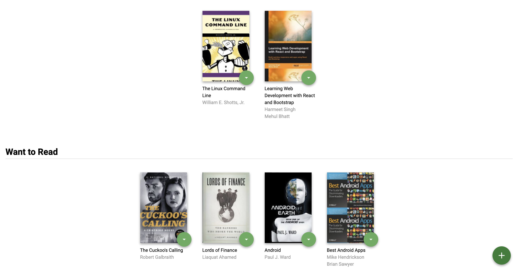
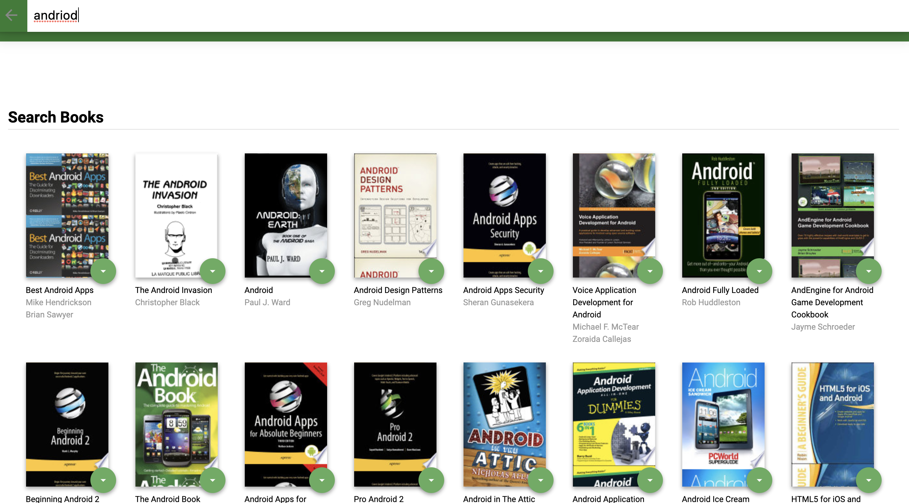

# React Nanodegree Project #1: MyReads App

**MyReads** App is a react application to search and track books based on title or authors.

## Installation

```bash
npm install
npm start
```
## Screenshots
 





## License

MyReads app is under MIT license.

## Additional Information

[Udacity React Nanodegree](https://www.udacity.com/course/react-nanodegree--nd019)
